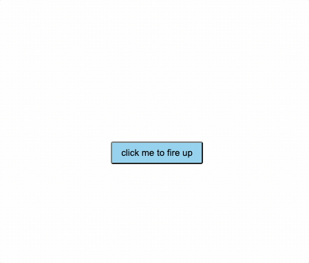

# vue3-circle-menu

## Demo



## How to use

```vue
<script lang="ts">
import { defineComponent } from "vue";
import Vue3CircleMenu from "vue3-circle-menu";

export default defineComponent({
  name: "App",
  components: {
    Vue3CircleMenu,
  },
  setup: () => {
    return {
      showAlert: (text: string) => {
        alert(text);
      },
    };
  },
});
</script>

<template>
  <div id="app" class="father">
    <vue3-circle-menu :distance="180" :menu-items="['A', 'B', 'C']">
      <template v-slot:default>
        <button class="button">click me to fire up</button>
      </template>

      <template v-slot:A>
        <div
          class="circle"
          @click="
            () => {
              showAlert('A');
            }
          "
        >
          Hello, A
        </div>
      </template>
      <template v-slot:B>
        <div
          div
          class="circle"
          @click="
            () => {
              showAlert('B');
            }
          "
        >
          Hello, B
        </div>
      </template>
      <template v-slot:C>
        <div
          div
          class="circle"
          @click="
            () => {
              showAlert('C');
            }
          "
        >
          Hello, C
        </div>
      </template>
    </vue3-circle-menu>
  </div>
</template>

<style lang="scss">
.father {
  width: 100vw;
  height: 100vh;
  display: flex;
  align-items: center;
  justify-content: center;
  align-content: center;
  .button {
    position: relative;
    display: inline-block;
    padding: 0.5em 1em;
    background: skyblue;
    border-radius: 3px;
    cursor: pointer;
    user-select: none;
  }
}

.circle {
  position: relative;
  // width: 30px;
  // height: 30px;
  width: 80px;
  height: 30px;
  border-radius: 50%;
  background-color: rgb(135, 235, 140);
  box-shadow: 0 0 10px rgba(0, 0, 0, 0.5);
  overflow: hidden;
  text-align: center;
  display: flex;
  justify-content: center;
  align-items: center;
}
</style>
```

## author

yingshaoxo
